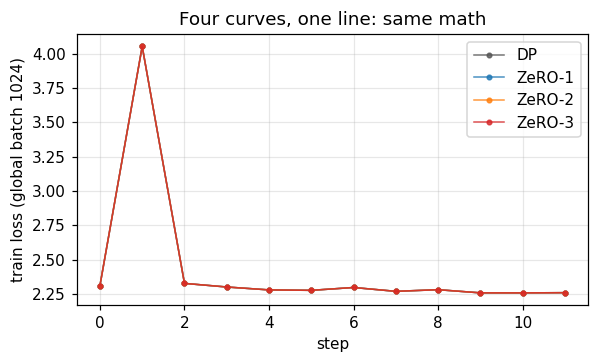
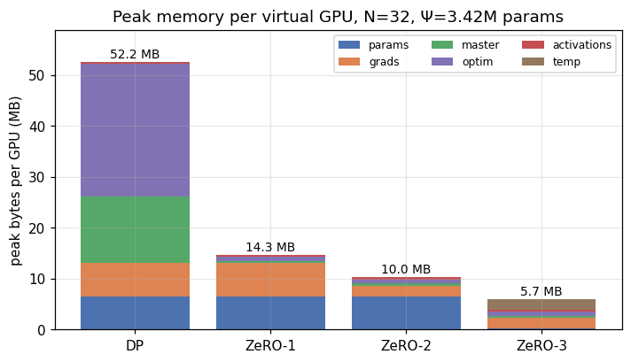
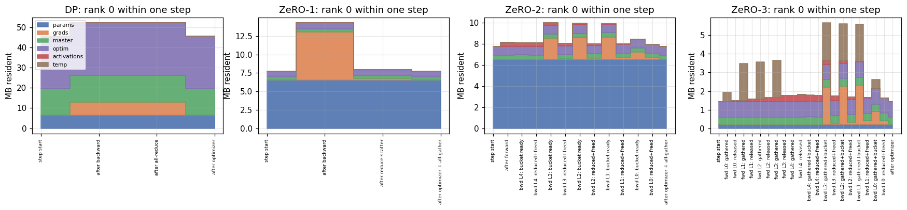
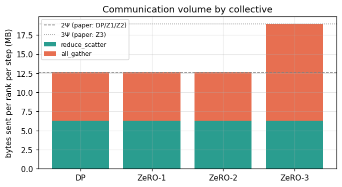
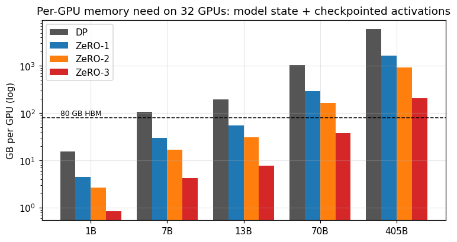
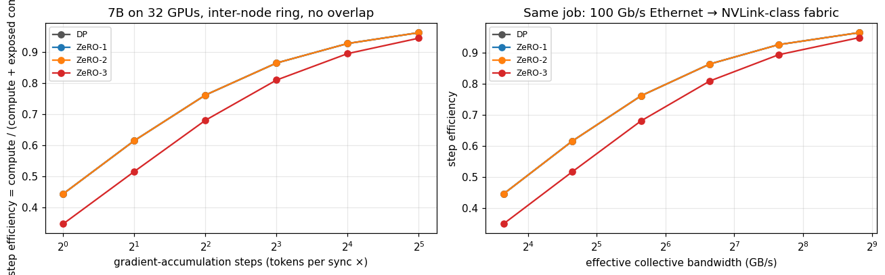

# zero-sim: ZeRO-1 / ZeRO-2 / ZeRO-3 on 32 virtual GPUs

> 32 CPU threads pretend to be 32 GPUs (4 nodes × 8). A small model is trained on them four ways —
> plain data parallel, ZeRO-1, ZeRO-2, ZeRO-3 — and every byte in "HBM" and every byte on the "wire" is counted.
> The result reproduces the ZeRO paper's memory and communication formulas exactly, and the weights after
> every step are **bitwise identical** across all four strategies.

**Notebook:** [`zero_sim_demo.ipynb`](zero_sim_demo.ipynb) (executed, with all outputs and plots) ·
**Library:** [`zero_sim/`](zero_sim) · **Tests:** [`tests/`](tests) (16 tests encode the claims below)

```bash
pip install -r requirements.txt
python -m pytest tests -q            # 16 passed
python run_demo.py                   # prints the memory / communication table for all four stages
jupyter notebook zero_sim_demo.ipynb # or just read it on GitHub
```

---

## 1. What I built, and why this way

Everything is pure NumPy. There is no GPU, no `torch.distributed`, no DeepSpeed. That is deliberate: the point
of the exercise was to understand *what those libraries do*, and the fastest way to be sure I understood was to
build the bookkeeping myself and check it against the paper.

```
zero_sim/
├── cluster.py    VirtualGPU (memory ledger + storage + own thread), Cluster (32 ranks, 4 nodes),
│                 ring collectives: broadcast / reduce_scatter / all_gather / all_reduce, byte + time accounting
├── model.py      5-layer MLP (~3.4M params) with hand-written forward/backward, flat per-layer buffers
├── trainers.py   DataParallelTrainer, ZeRO1Trainer, ZeRO2Trainer, ZeRO3Trainer
└── analytic.py   the closed-form ZeRO memory / communication formulas, used to check the simulator
```

Design choices that matter:

* **A virtual GPU is a ledger, not a device.** `VirtualGPU.put(key, array, category)` is `cudaMalloc` with a label
  (`params`, `grads`, `master`, `optim`, `activations`, `temp`); `drop(key)` is `cudaFree`. The ledger keeps live
  bytes per category, high-water marks, and a per-phase timeline. Each rank's compute runs on its own thread in a
  32-worker pool, so the ranks genuinely run concurrently on my CPU.
* **Collectives are real ring algorithms**, executed step by step (N−1 steps, one chunk per rank per step), not
  `np.sum` with a fudge factor. That is how I convinced myself that reduce-scatter and all-gather each cost a rank
  `(N−1)/N × size` bytes, and that **all-reduce = reduce-scatter + all-gather** is an implementation fact, not a slogan.
  A simple α–β cost model (latency + bytes/bandwidth) turns bytes into modelled seconds, with a 9× slower link when a
  ring spans nodes.
* **Hand-written backprop.** ZeRO-3 has to gather a layer's weights right before they are used and free them right
  after, in both forward and backward, and reduce-scatter a layer's gradient the moment it exists. With explicit
  `layer_forward` / `layer_backward` calls that choreography is visible in ~30 lines instead of hidden behind
  autograd hooks.
* **Flat, padded, per-layer parameter buffers**, exactly the DeepSpeed / FSDP convention: every layer's parameters
  are one contiguous buffer padded to a multiple of 32, so rank *r* owns chunk *r* of every layer in every stage.
* **Mixed precision for real.** Working weights and gradients are 16-bit (`float16` stands in for `bfloat16`, which
  NumPy lacks), master weights and Adam moments are fp32. That is where the famous **16 bytes per parameter** comes from:
  2 (weights) + 2 (grads) + 4 (fp32 master) + 4 (Adam m) + 4 (Adam v).

A lesson I did not plan to learn: my first run was ~50× too slow because 32 Python threads each called a
multithreaded BLAS on a 4-core box. Pinning BLAS to one thread per virtual GPU fixed it. The production lesson —
stragglers, thermal throttling, network congestion and rank imbalance are real failure modes — applies to
host-side oversubscription too.

## 2. The four strategies, as I now understand them

The model state a training step must keep around is: parameters, gradients, and optimizer state. Data parallelism
replicates all three on every GPU. ZeRO's idea is simply: **stop storing identical copies of things that are only
needed in one place.**

| | params (2Ψ) | grads (2Ψ) | optimizer (12Ψ) | per-GPU bytes | how the step syncs |
|---|---|---|---|---|---|
| **DP** | replicated | replicated | replicated | 16Ψ | all-reduce(grads); every rank runs the full Adam update |
| **ZeRO-1** | replicated | replicated | **sharded** | 4Ψ + 12Ψ/N | reduce-scatter(grads) → each rank updates *its* Ψ/N → all-gather(params) |
| **ZeRO-2** | replicated | **sharded** | sharded | 2Ψ + 14Ψ/N | same, but reduce-scatter happens *per layer bucket during backward*, so the full gradient never exists |
| **ZeRO-3** | **sharded** | sharded | sharded | 16Ψ/N (+1 layer) | all-gather(layer) just-in-time in forward **and** backward; reduce-scatter(grad) per layer; no param all-gather at the end |

The insight that unlocked it for me: **rank *r* only ever needs the *reduced* gradient for the parameters it
owns.** So the all-reduce in DP is doing more work than necessary — its second half (all-gather of the gradients)
is wasted if only 1/N of the gradient is used locally. ZeRO-1 replaces it with a reduce-scatter and moves the
all-gather to *after* the update, on the parameters. Same bytes, but now the optimizer state only needs to exist
for the owned shard. ZeRO-2 notices the reduce-scatter can be issued the moment a layer's gradient is ready, so
the full gradient buffer never has to exist. ZeRO-3 notices that if parameters are re-gathered before every use,
they don't have to persist either — the price is one extra all-gather per step.

The database analogy is the one that stuck with me: DP replicates the whole database plus indexes plus
transaction log on every worker; ZeRO partitions the metadata (optimizer), then the change log (gradients), then
the primary data (parameters).

## 3. What the simulator measured

All numbers: Ψ = 3,422,240 (padded) parameters, N = 32, micro-batch 32 per rank → global batch 1024.

### 3a. Sharding does not change the math

After 12 optimizer steps, `max |Δweight|` between every ZeRO stage and plain DP is **0.0** — bitwise identical.
The loss curves lie on top of each other. This is the property I most wanted to verify: ZeRO is about *where bytes
live*, not about the algorithm.



### 3b. Memory per GPU

| stage | params | grads | master | Adam m+v | activations | temp | **peak / GPU** | paper formula | vs DP |
|---|---|---|---|---|---|---|---|---|---|
| DP | 6.5 MB | 6.5 MB | 13.1 MB | 26.1 MB | 400 KB | 0 | **52.2 MB** | 16Ψ = 52.2 MB | 1.0× |
| ZeRO-1 | 6.5 MB | 6.5 MB | 418 KB | 836 KB | 400 KB | 0 | **14.3 MB** | (4+12/N)Ψ = 14.3 MB | 3.7× |
| ZeRO-2 | 6.5 MB | 2.1 MB | 418 KB | 836 KB | 400 KB | 0 | **10.0 MB** | (2+14/N)Ψ = 8.0 MB | 5.2× |
| ZeRO-3 | 209 KB | 2.1 MB | 418 KB | 836 KB | 400 KB | 2.0 MB | **5.7 MB** | 16Ψ/N = 1.6 MB | 9.2× |



What I took from the bars, beyond the headline ratios:

* **The optimizer is the elephant.** 12 of 16 bytes/param. Sharding only it (ZeRO-1) already gives 3.7× at N=32,
  with no extra communication. This is why ZeRO-1 is the "always on" stage.
* **ZeRO-2's gradient bar isn't Ψ/N.** At the peak, one layer's full gradient bucket exists while it waits to be
  reduce-scattered. Peak = persistent + largest bucket. That is why bucket size is a tuning knob and not
  "as small as possible".
* **ZeRO-3's `temp` bar is one gathered layer.** Peak ≈ 16Ψ/N + the largest layer's weights (+ its gradient
  bucket in backward). ZeRO-3's memory is bounded by the largest *layer*, not the model — which is why
  extremely wide layers still need tensor parallelism.
* **Activations are untouched.** Identical in all four bars. ZeRO shards model *state*; activations scale with
  micro-batch × sequence × width × depth and need other tools (activation checkpointing, sequence parallelism).
  A common misconception — that batch size multiplies model copies — is debunked here: only the red sliver moves
  with batch size.

The within-step timeline of rank 0 shows the choreography that the peaks hide: ZeRO-2's sawtooth as each layer's
bucket is created, reduced and freed during backward; ZeRO-3's gather/release spikes in *both* directions:



### 3c. Communication per rank per step

| stage | reduce-scatter | all-gather | # collectives | **total / rank / step** | paper | × DP |
|---|---|---|---|---|---|---|
| DP | 6.3 MB | 6.3 MB | 10 | **12.6 MB** | 2Ψ | 1.00× |
| ZeRO-1 | 6.3 MB | 6.3 MB | 10 | **12.6 MB** | 2Ψ | 1.00× |
| ZeRO-2 | 6.3 MB | 6.3 MB | 10 | **12.6 MB** | 2Ψ | 1.00× |
| ZeRO-3 | 6.3 MB | 12.6 MB | 15 | **19.0 MB** | 3Ψ | 1.50× |



* DP's all-reduce *is* a reduce-scatter plus an all-gather, so it costs the same 2Ψ as ZeRO-1/2's explicit pair.
  ZeRO-1 and ZeRO-2 are **memory for free** in terms of bytes.
* What ZeRO-2 changes is *when*: one collective per bucket during backward, which is what makes overlap with the
  rest of backward possible. More collectives, same bytes.
* ZeRO-3's extra Ψ is the forward all-gather, and it sits on the critical path: layer *l+1* can't start until its
  weights arrive. Real implementations prefetch the next layer's gather while computing the current one. When that
  can't hide it, "ZeRO-3 makes the model fit; it does not automatically make training fastest."

### 3d. Computation and time

* **FLOPs per rank are identical in all four stages** (6.56e8 for the toy). Sharding *storage* does not shard
  *compute*: every rank still runs the whole forward and backward on its micro-batch. Only the optimizer step is
  de-duplicated — DP runs Adam on all Ψ on every rank, ZeRO on Ψ/N — which showed up as DP having ~3× more thread
  compute time than the ZeRO stages.
* **On modelled H100-class hardware the toy is ~100% communication-bound** (compute 0.002 ms, comm 6–10 ms). A
  model that fits on one GPU should not be sharded across 32; "faster GPUs make networking look worse",
  taken to the limit.
* **A synchronous step runs at the pace of its slowest rank.** Injecting a 1 s delay into rank 17's forward pass
  added ~0.8–1.0 s to every rank's step: 31 virtual GPUs idled waiting for one. Every collective is a barrier.
  Observability has to be per-rank.

## 4. Scaling the formulas to real models on 32 × 80 GB

The toy proves the simulator matches the formulas; the formulas then extrapolate. With N = 32, 80 GB HBM,
15% headroom, micro-batch 1 × 4096 tokens with full activation checkpointing:

| model | DP | ZeRO-1 | ZeRO-2 | ZeRO-3 |
|---|---|---|---|---|
| 1B | 15 GB ✓ | 4.4 GB ✓ | 2.6 GB ✓ | 0.9 GB ✓ |
| 7B | 105 GB ✗ | 29.5 GB ✓ | 16.9 GB ✓ | 4.3 GB ✓ |
| 13B | 195 GB ✗ | 54.5 GB ✓ | 31.1 GB ✓ | 7.6 GB ✓ |
| 70B | 1.0 TB ✗ | 290 GB ✗ | 164 GB ✗ | 37.6 GB ✓ |
| 405B | 5.9 TB ✗ | 1.6 TB ✗ | 935 GB ✗ | 204 GB ✗ |



So the practical rule — *choose the lowest sharding stage that fits with a safety margin* — gives: ZeRO-1 for
7B/13B, ZeRO-3 for 70B, and 405B needs more GPUs plus other parallelism dimensions (tensor/pipeline/expert).

And the cost side, for 7B on 32 GPUs with the ring crossing nodes at 50 GB/s:

| stage | compute | comm | efficiency, no overlap | 75% overlap | grad-accum ×8 |
|---|---|---|---|---|---|
| DP / ZeRO-1 / ZeRO-2 | 435 ms | 544 ms | 44% | 76% | 87% |
| ZeRO-3 | 435 ms | 816 ms | 35% | 68% | 81% |



`efficiency = compute / (compute + exposed communication)`. Communication is a fixed cost per step, compute scales
with tokens — so gradient accumulation (bigger global batch) amortises it, overlap hides it, and a faster fabric
shrinks it. ZeRO-3's 1.5× is a small tax when communication is hidden and a large one when it isn't.

## 5. How this maps to what real labs run

* **DeepSpeed ZeRO** stages 1/2/3 are exactly the four trainers here, plus ZeRO-Offload / ZeRO-Infinity, which
  push optimizer state or parameters to CPU RAM / NVMe when even ZeRO-3 doesn't fit. Offload is a
  capacity/throughput trade-off, not a taboo.
* **PyTorch FSDP / FSDP2** is ZeRO-3 as a native PyTorch wrapper (`FULL_SHARD` ≈ ZeRO-3, `SHARD_GRAD_OP` ≈ ZeRO-2).
  Its **`HYBRID_SHARD` (HSDP)** mode is the topology lesson made concrete: ZeRO-3 *inside* each node, where the 3Ψ
  of all-gathers ride the 450 GB/s NVSwitch, and plain DP all-reduce *across* nodes over the slow link. Map the
  heaviest collective to the fastest physical link.
* **Frontier runs combine dimensions.** Llama-3 405B (per Meta's report, ~16k H100s) used tensor parallelism
  inside a node, pipeline parallelism across stages, context parallelism for long sequences, and FSDP across the
  data-parallel dimension. Mixture-of-experts adds expert parallelism. A distinction worth keeping sharp: ZeRO-3 and
  pipeline parallelism both "split things across GPUs" but ZeRO-3 shards *ownership of state* within a DP group, while
  pipeline shards *execution*.

What the simulator deliberately leaves out — and where the real engineering lives:

| here | in production |
|---|---|
| collectives run between compute phases, on the host | NCCL runs them on separate CUDA streams, overlapped with compute; prefetching the next layer's all-gather is the key ZeRO-3 optimisation |
| one bucket = one layer | bucket sizes tuned (tens to hundreds of MB): too small → launch overhead, too big → no overlap |
| flat 32-rank ring | NCCL picks ring / tree / hierarchical algorithms per topology, intra-node first, then inter-node |
| activations always kept | activation checkpointing, selective recompute, FlashAttention |
| nothing fails | checkpoint cadence, sharded checkpoints, restore *tests*, straggler detection, immutable configs |
| fp16 stands in for bf16 | bf16 keeps fp32's exponent range, which is why it is the training default; fp8 needs per-tensor scaling recipes |

## 6. The questions that matter when you run this at scale, answered by the simulation

| question | what I can now say |
|---|---|
| **Capacity** — what must live on GPU at peak? | 16 bytes/param in DP; the optimizer is 12 of them. ZeRO-1 alone gives 3.7× at N=32. ZeRO-3 peak ≈ 16Ψ/N + largest layer. Activations are not touched by any stage. |
| **Topology** — what crosses node boundaries? | Every collective in a 32-rank ring crosses nodes and runs at inter-node speed. HSDP exists to put the 3Ψ traffic on the fast link. |
| **Performance** — compute-, memory- or comm-bound? | Toy: 100% comm-bound. 7B: efficiency depends more on accumulation and overlap than on ZeRO stage; ZeRO-3 is a fixed 1.5× bytes. |
| **Reliability** — how much is lost to failure? | One slow rank stalls 32 — a synchronous step is a barrier. Per-rank observability is not optional. |
| **Economics** — productive vs waiting GPU time? | `compute / (compute + exposed comm)`. Buy it back with accumulation (free), overlap (engineering), fabric (money) — in that order. |

## 7. Repository layout

```
.
├── README.md
├── zero_sim_demo.ipynb        executed notebook: experiments, plots, explanations
├── run_demo.py                CLI: prints the memory / comm table for all stages
├── zero_sim/                  the simulator (see §1)
├── tests/test_zero_sim.py     16 tests: collectives, bitwise equivalence, paper formulas, memory ladder, 1.5× comm
├── figures/                   plots exported from the notebook
└── requirements.txt           numpy, matplotlib, threadpoolctl (+ pytest, jupyter to run)
```

## References

* Rajbhandari, Rasley, Ruwase, He — *ZeRO: Memory Optimizations Toward Training Trillion Parameter Models* (2020)
* PyTorch FSDP / FSDP2 documentation; DeepSpeed ZeRO documentation
* Korthikanti et al. — *Reducing Activation Recomputation in Large Transformer Models* (2022) (activation estimate)
* Meta — *The Llama 3 Herd of Models* (2024) (4D parallelism at scale)
